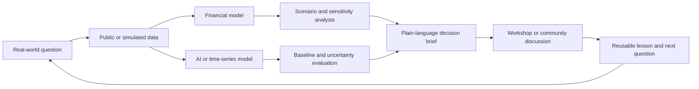
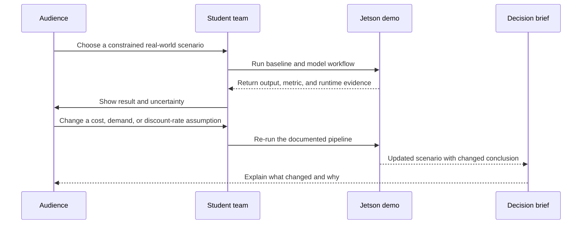

# Real-World Impact Plan

## The central idea

The project should not stop at “students trained a model.” The real-world value is a repeatable **Decision Lab** where students take a constrained, understandable problem, analyze it with financial and computational tools, test the limits of those tools, and communicate a careful decision brief to a real audience.

The project’s impact is therefore practical and teachable:

> Students learn to turn data into a defensible explanation that a nontechnical person can question, understand, and use responsibly.

This creates a stronger outcome than a flashy prediction. It gives students a process they can apply to budgeting, program planning, resource allocation, operational forecasting, and other decisions where assumptions matter.

## The impact chain



Each stage leaves evidence behind. A reader should be able to see the original question, the data, the assumptions, the model output, the uncertainty, and the reason for the final recommendation or non-recommendation.

## Flagship experience: the Decision Challenge

Once each semester, the team can run a **Decision Challenge**. The challenge uses a realistic but safe scenario such as:

- How should a student organization allocate a fixed educational or outreach budget?
- Which workshop format is most likely to reach students under limited time and equipment?
- How should a community program compare several spending scenarios when costs and participation are uncertain?
- How can a team forecast demand for an event or educational resource without pretending the forecast is certain?

The scenario should use public, synthetic, or explicitly approved data. It must not require private student records, brokerage data, or individualized financial information.

### What happens during the challenge

1. Participants receive the same question and a small, understandable dataset.
2. Teams build a transparent baseline before trying a more advanced model.
3. Teams use the BA II Plus calculators to test time value of money, cash-flow, or scenario assumptions.
4. Teams use the Jetson kits to demonstrate a reproducible model or edge-AI workflow.
5. Teams stress-test the result by changing assumptions and showing when the conclusion changes.
6. Each team produces a short decision brief with a recommendation, evidence, uncertainty, and “do not conclude” section.
7. The audience discusses whether the result is useful, what information is missing, and what decision should be made next.

### The “wow” moment

The strongest demonstration is an assumption toggle:



The audience sees that models do not produce magic answers. They produce conditional evidence. That is the moment that connects quantitative finance, AI, and responsible decision-making.

## Who benefits

| Audience | Real-world benefit |
| --- | --- |
| Student contributors | Practice turning ambiguous questions into documented, testable work; build evidence they can explain in interviews or future coursework |
| Workshop participants | Gain practical quantitative literacy without needing to become financial professionals or machine-learning specialists |
| Student organizations and campus programs | Receive reusable frameworks for thinking about budgets, outreach, attendance, and program scenarios |
| Project leads | Build a repeatable curriculum and a quality-controlled archive instead of one-off demonstrations |
| Funder and organization | See concrete evidence of reach, learning, responsible use of equipment, and reusable educational impact |

## Impact pillars

### 1. Capability

Students can explain the full path from question to decision. They can identify a baseline, describe uncertainty, and recognize when a model is not appropriate.

### 2. Applied usefulness

Every major workshop produces something usable: a decision brief, a reproducible example, a lesson plan, a hardware protocol, or a tested visualization.

### 3. Responsible innovation

The project demonstrates that AI and quantitative finance can be ambitious without overclaiming. Students learn about leakage, bias, sensitivity, privacy, non-stationarity, and the difference between evidence and advice.

### 4. Continuity

The equipment and documentation support future cohorts. A new student should be able to open the repository, follow a setup protocol, rerun an example, and improve it.

## Proposed impact targets

These are planning targets, not completed results. Actual numbers must be recorded in reviewed notebook entries and periodic funder check-ins.

| Target | Evidence to collect |
| --- | --- |
| Reach approximately 20–30 students | Aggregate attendance by event or workshop; never include unnecessary personal information |
| Deliver at least three distinct learning experiences | Lesson plans, facilitator notes, and workshop records |
| Produce at least one Decision Challenge | Challenge brief, participant outputs, review notes, and final showcase artifact |
| Create reusable technical examples | Reproducible notebooks, setup instructions, data provenance, and versioned artifacts |
| Improve quantitative confidence | Short pre/post concept checks or anonymous surveys |
| Demonstrate responsible modeling | Examples showing baselines, uncertainty, sensitivity, and limitations |
| Preserve equipment value | Setup logs, condition checks, usage records, and future-use protocols |

## What makes the result credible

The team should avoid measuring impact only by attendance. A strong impact record combines:

- **Reach:** Who participated and how many people were served in aggregate.
- **Learning:** What participants could explain or do after the experience.
- **Artifact quality:** Whether another person can reproduce or teach the material.
- **Decision quality:** Whether teams stated assumptions, uncertainty, and limitations.
- **Continuity:** Whether the work can support the next workshop or academic year.
- **Accountability:** Whether the project can show the funder what was done with the resources.

## Showcase format

At the end of a project phase, host a short **Algorithmic Markets Demo Night**:

1. A five-minute explanation of the Decision Challenge.
2. A live baseline-versus-model comparison.
3. A Jetson runtime or edge-AI demonstration.
4. A financial scenario calculation using the BA II Plus.
5. An assumption toggle that changes the output.
6. A two-minute decision brief from each team.
7. A closing discussion about what the models could not tell us.

The showcase should celebrate clear reasoning, not confident predictions. The best team is the team that can explain both what its analysis supports and what it does not support.

## Impact reporting loop

```text
Workshop or challenge
  → Participant artifact
  → Lead review
  → Aggregate learning/reach evidence
  → Reusable material
  → Periodic funder check-in
  → Next challenge or workshop
```

Sanchin and Cail own the project evidence and review. Summer’s role is to periodically summarize that reviewed evidence for the funder.

## Related documents

- [Project overview](README.md)
- [Project roadmap](ROADMAP.md)
- [Workstreams and deliverables](WORKSTREAMS.md)
- [Lab notebook handbook](../Lab%20Notebooks/README.md)
