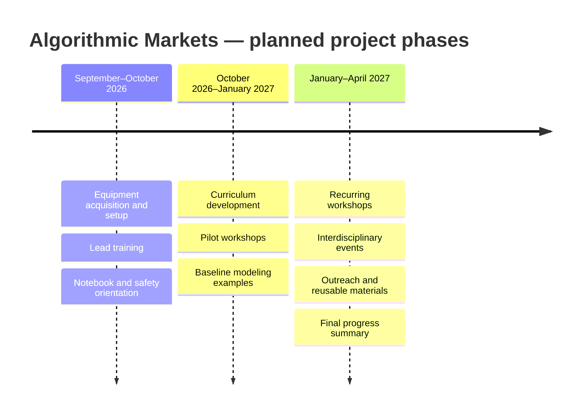

# Project Roadmap

This roadmap is a planning skeleton for September 2026 through April 2027. Sanchin and Cail may adjust task order as the project develops; material changes should be documented in the lab notebooks.

## Phase map

## Milestones

| Window | Phase | Main work | Evidence of completion | Lead |
| --- | --- | --- | --- | --- |
| September 2026 | Foundation | Confirm equipment, repository workflow, contributor intake, and safety/data rules | Setup entries, approved scope, onboarding records | Sanchin and Cail |
| September–October 2026 | Technical preparation | Configure Jetson kits, test calculators, and create first reproducible examples | Hardware logs, environment details, first reviewed notebook entries | Sanchin and Cail |
| October–November 2026 | Curriculum build | Write learning objectives, exercises, examples, and facilitator notes | Draft workshop packets and pilot review notes | Sanchin and Cail with contributors |
| November 2026–January 2027 | Pilot delivery | Run initial demonstrations and collect structured observations | Workshop notes, participant feedback, revisions | Sanchin and Cail |
| January–March 2027 | Recurring programming | Deliver workshops and interdisciplinary events; onboard additional contributors as needed | Event records, reusable materials, progress summaries | Sanchin and Cail |
| March–April 2027 | Consolidation | Refine examples, archive results, summarize reach and lessons learned | Final artifact index, documented limitations, final progress record | Sanchin and Cail |

## Phase gates

### Gate 1: Ready to build

- Project scope and out-of-scope rules are understood.
- Equipment and access are documented.
- Contributors know how to create a notebook entry.
- No private financial data or secrets are being used.

### Gate 2: Ready to teach

- Each lesson has a learning objective and expected student output.
- The example has a baseline or a reason one is not applicable.
- Data source, assumptions, metrics, and limitations are written down.
- The financial education disclaimer is visible.
- A project lead has reviewed the materials.

### Gate 3: Ready to reuse

- A new contributor can follow the setup and reproduce the intended result.
- Outputs are named and linked.
- Known failures and limitations are preserved.
- The material is appropriate for the stated audience and does not overclaim.

## Reporting rhythm

Sanchin and Cail maintain the detailed project record. Summer periodically prepares a short [funder check-in](../Lab%20Notebooks/Summer/readme.md) based on completed, reviewed evidence. A check-in should report what changed since the last update, what is currently active, what is blocked, and what is next.

## Open planning questions

Record answers in the relevant notebook entry rather than silently deciding them here:

- Which workshops should be piloted first?
- Which public or simulated datasets best match the intended audience?
- Which contributor roles are needed after the first onboarding round?
- What format will be used to collect participant feedback?
- Which outputs should be preserved for the next academic year?
