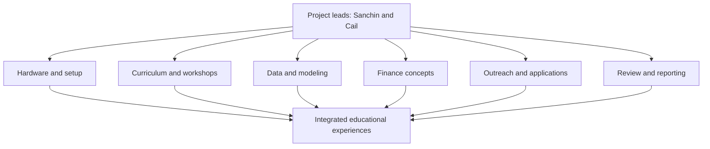

# Project Workstreams and Deliverables

Sanchin and Cail coordinate all workstreams. Contributors may own individual tasks, but every task must have a named lead, a defined output, and a notebook record.

## Workstream map



## Workstream details

| Workstream | Problem it solves | Typical tasks | Deliverables |
| --- | --- | --- | --- |
| Hardware and setup | Students need a visible, hands-on way to understand computational systems | Configure Jetsons, record versions, test runtimes, benchmark simple workloads, maintain equipment notes | Setup protocol, hardware notebook entries, benchmark examples, safe-use checklist |
| Curriculum and workshops | Students need a guided path from concepts to practice | Define learning objectives, write exercises, prepare demos, pilot activities, revise based on observations | Lesson plans, facilitator guides, exercises, answer keys, workshop records |
| Data and modeling | Students need to understand how inputs become model outputs | Select public/simulated data, clean data, build baselines, run models, evaluate time-series behavior | Dataset metadata, reproducible experiments, figures, metrics, limitations |
| Finance concepts | Students need to connect computational outputs to financial reasoning | Build valuation and risk examples, use calculators, explain assumptions, test scenarios | DCF/NPV/IRR examples, formula references, sensitivity tables, explanation notes |
| Outreach and applications | The project needs contributors and student participation | Review applications, onboard contributors, coordinate events, track aggregate reach | Application records, onboarding entries, event plans, aggregate participation notes |
| Review and reporting | Work must remain understandable, safe, and funder-ready | Review entries, track milestones, preserve evidence, identify blockers, summarize progress | Review records, decision notes, artifact index, periodic funder check-ins |

## Deliverable quality checklist

Before a deliverable is marked complete, confirm:

- The intended audience and learning objective are clear.
- The scope is educational and does not imply live financial use.
- Inputs, sources, assumptions, and versions are documented.
- A reader can distinguish observation from interpretation.
- Results include a baseline, metric, or explicit reason those are not applicable.
- Limitations and likely failure modes are visible.
- A project lead has reviewed the material.
- The final file links to the supporting notebook entry or artifact.

## Dependency chain

```text
Approved contributor
  → Scoped task
  → Notebook entry
  → Lead review
  → Workshop / example / protocol
  → Reusable project artifact
  → Periodic funder update
```

No single workshop or model is the whole project. The durable outcome is a documented, reusable system for teaching quantitative decision-making responsibly.

## Suggested first tasks for applicants

- Reproduce a simple time-value-of-money example and document every assumption.
- Create a baseline time-series visualization using a public or simulated dataset.
- Draft a Jetson setup checklist and test it with another contributor.
- Convert one financial concept into a short workshop exercise.
- Review an existing notebook entry for missing provenance, parameters, or limitations.
